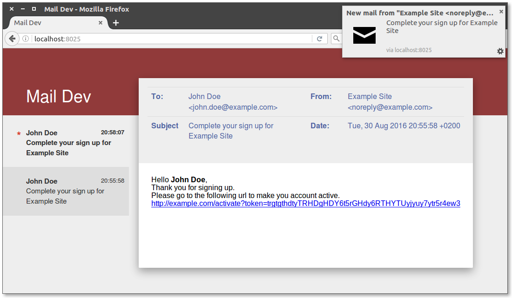

Mail Dev
========
Is a dummy SMTP server that will display all its received mail through its web interface.
Thus making it a very useful tool for testing mail sending features during development.

*Be aware that this tool is still in development, so some weird things can happen ;)*

Features & Planned features
---------------------------

 - [x] Multi platform, because it is written in GO it should be able to run on Linux, Mac and Windows. (Only tested on Linux though)
 - [x] Basic build-in SMTP that is able to receive e-mail
 - [x] After a message has been received you will get an instant notification thanks to a websocket connection
 - [ ] Able to view a raw version of the e-mail including the headers
 - [ ] Display inline attachments
 - [ ] Able to download attachments 
 
How to use Mail Dev
-------------------
To use this software, grep a copy from the [release](https://github.com/marchoh/maildev/releases) page. Extract the
archive and run the `maildev` binary  (*make sure the public directory is in the current working directory*)
and you are good to go. The web interface will be served from port `8025` and the SMTP server will listen to
port `2525`.

Screenshots
-----------

(The web interface of Mail Dev)

Contributing
------------
I'm always open for pull requests.

License & Copyright
-------------------
Mail Dev is released under the MIT license, for more details see the LICENSE file.

Copyright 2016 Marc Heuker of Hoek